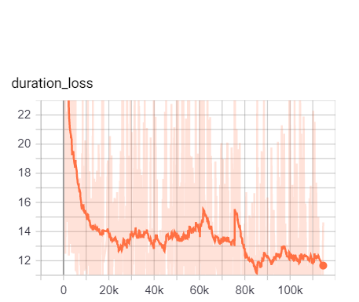
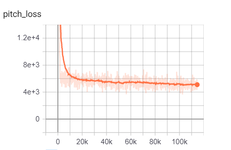
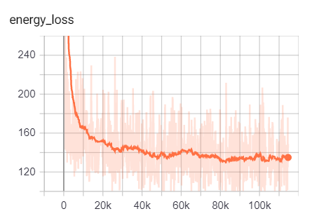
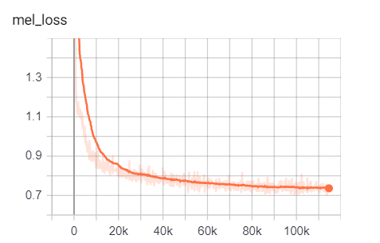
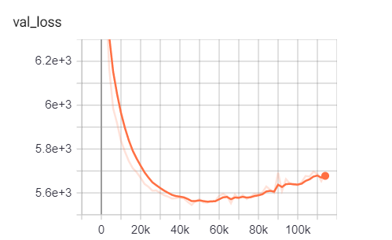
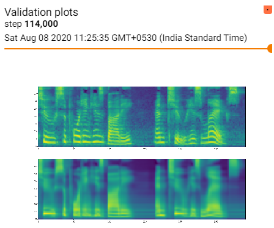

# FastSpeech 2 :airplane:
A novoice's PyTorch implementation of [**FastSpeech 2: Fast and High-Quality End-to-End Text to Speech**](https://arxiv.org/abs/2006.04558) based on FastSpeech implementation of [**Deepest-Project FastSpeech**](https://github.com/Deepest-Project/FastSpeech).
The quality of voice samples generated by this repo is not upto mark, major reason being the use of `batch_size = 8` due to inferior GPU memory and processing power. With `batch_size>8` my CUDA memory ran out.
I would be glad if anyone reading this repo can take up the training with `batch_size` as given in the paper and/or suggest ways of improving the results. :innocent: 

  


## For Demo :sunny:  
Download the checkpoint from [here](https://drive.google.com/file/d/12jW1KivfEjv4YBs6gAZVdVWJ-muZv6CQ/view?usp=sharing) trained on LJSpeech dataset. Place it in the `training_log` folder. And run the [inference.ipynb](./inference.ipynb). For mel to audio generation I have used MelGan from :flashlight: torch hub.  

## Requirements :sunny:
All code is writen in `python 3.6.10`.  
`requirements.txt` contains the list of all packages required to run this repo.
```
pip install -r requirements.txt
```  
For smooth working download the latest torch and suitable cuda version from [here](https://pytorch.org/). This repo works with pytorch => 1.4. Not sure about the lower versions, let me know if they work.  

Before moving to the next step update the `hparams.py` file as per your requirements. 

## Pre-preocessing :sunny:
The folder [MFA_filelist](./MFA_filelist/) contains pre extracted alignments using [Montreal Forced Aligner](https://montreal-forced-aligner.readthedocs.io/en/latest/) on the [LJSpeech](https://keithito.com/LJ-Speech-Dataset/) Dataset. For more information on using MFA visit [here](https://github.com/ivanvovk/DurIAN#6-how-to-align-your-own-data). 
```
python preprocess.py -d /root_path/to/wavs/
python compute_statistics.py
```
Update the hparams.py file with appropraite infor about pitch and energy  

## Train :sunny:
Make sure you have the `training_log` folder existing in the repo before running the below command.
```
python train.py
```  

## Tensorboard images :sunny:



  



## Generated vs Original Mel  :sunny:

  


## Note  :sunny:

## References  :sunny:

- [FastSpeech 2: Fast and High-Quality End-to-End Text to Speech](https://arxiv.org/abs/2006.04558)
- [FastSpeech: Fast, Robust and Controllable Text to Speech](https://arxiv.org/abs/1905.09263)
- [MelGAN](https://github.com/seungwonpark/melgan)
- [rishikksh20/FastSpeech2](https://github.com/rishikksh20/FastSpeech2)
- [Deepest-Project FastSpeech](https://github.com/Deepest-Project/FastSpeech)
